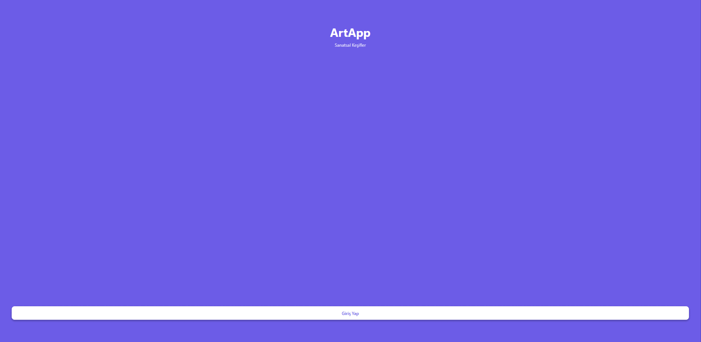

# 🎨 DoodleAI

<div align="center">
  <h1>
    
    Doodle<em>AI</em>
  </h1>
  <h3>🖌️ Hayal Et, Çiz, Paylaş!</h3>
  
  
</div>

<p align="center">
  
  
  
  
  
</p>

## 📋 İçindekiler

- [Proje Hakkında](#-proje-hakkında)
- [Özellikler](#-özellikler)
- [Teknolojiler](#-teknolojiler)
- [Sistem Mimarisi](#-sistem-mimarisi)
- [Klasör Yapısı](#-klasör-yapısı)
- [Kurulum](#-kurulum)
- [API Referansı](#-api-referansı)
- [Katkı Sağlama](#-katkı-sağlama)
- [Lisans](#-lisans)

## 🎯 Proje Hakkında

**DoodleAI**, kullanıcıların mobil veya web üzerinden kendi çizimlerini yapabildiği, yapay zeka ile resim üretebildiği ve toplulukla paylaşabildiği modern bir sanat platformudur. Firebase altyapısı ile güvenli kimlik doğrulama, gerçek zamanlı veri yönetimi ve bulut depolama sunar.

## 🌟 Neden DoodleAI?

- **🖌️ Tuval Üzerinde Çizim:** Mobil ve web uyumlu gelişmiş çizim arayüzü.
- **🤖 Yapay Zeka ile Görsel Üretimi:** Prompt yazarak AI destekli resimler oluştur.
- **👥 Topluluk & Keşfet:** Diğer kullanıcıların çizimlerini keşfet, oy ver, yorum yap.
- **📈 Profil & İstatistik:** Kendi çizimlerini ve AI üretimlerini profilinde sergile.
- **🔒 Güvenli Giriş:** Firebase ile e-posta tabanlı kimlik doğrulama.
- **🌗 Karanlık/Parlak Tema:** Kişiselleştirilebilir tema desteği.

## 💡 Özellikler

### Kullanıcılar için
- Hesap oluşturma ve giriş
- Profil düzenleme ve istatistikler
- Kendi çizimlerini kaydetme ve paylaşma
- AI ile resim üretip kaydetme
- Diğer kullanıcıların çizimlerini keşfetme, oy verme ve yorum yapma

### Teknik Özellikler
- Gerçek zamanlı veri yönetimi (Firebase RTDB & Firestore)
- Mobil ve web uyumlu responsive arayüz
- Karanlık/aydınlık tema desteği
- Yorum, oy ve favori sistemi

## 🛠 Teknolojiler

| Teknoloji         | Açıklama                |
|-------------------|------------------------|
| React Native      | Mobil ve web arayüzü   |
| Expo              | Hızlı geliştirme       |
| Firebase          | Auth, Firestore, RTDB  |
| TypeScript        | Tip güvenliği          |
| React Navigation  | Sekmeli gezinme        |
| Pollinations.ai   | AI ile görsel üretimi  |

## 🏗 Sistem Mimarisi

- **Kullanıcı Arayüzü:** React Native + Expo
- **Backend:** Firebase (Auth, Firestore, RTDB, Storage)
- **AI Servisi:** Pollinations.ai (prompt tabanlı görsel üretimi)
- **Gerçek Zamanlı:** Firestore ve RTDB ile anlık veri güncellemeleri

## 📂 Klasör Yapısı

```
myProject/
├── app/                # Sayfalar ve ana uygulama dosyaları
│   ├── (tabs)/         # Ana sekmeler (canvas, generator, explore, profile)
│   ├── auth/           # Giriş ve kayıt sayfaları
│   ├── firebase.ts     # Firebase yapılandırması
│   ├── setup.ts        # Firestore koleksiyon kurulumu
├── components/         # Ortak React bileşenleri
│   └── ui/             # UI alt bileşenleri
├── context/            # Tema ve global contextler
├── constants/          # Sabitler (renkler vs.)
├── hooks/              # Özel React hook'ları
├── assets/             # Görseller ve fontlar
├── scripts/            # Yardımcı scriptler
├── package.json        # Bağımlılıklar ve scriptler
├── tsconfig.json       # TypeScript yapılandırması
└── README.md           # Proje dokümantasyonu
```

## ⚙️ Kurulum

1. **Depoyu klonla:**
   ```bash
   git clone <https://github.com/utkuakbay/DoodleAI>
   cd myProject
   ```

2. **Bağımlılıkları yükle:**
   ```bash
   npm install
   # veya
   yarn install
   ```

3. **Firebase yapılandırmasını kontrol et:**
   - `app/firebase.ts` dosyasındaki ayarları kendi Firebase projenize göre düzenleyin.

4. **Projeyi başlat:**
   ```bash
   npm start
   # veya
   yarn start
   ```
   - Mobilde test için Expo Go uygulamasını kullanabilirsin.

## 📘 API Referansı

- **Giriş:** `/auth/login`
- **Kayıt:** `/auth/register`
- **Çizim Kaydet:** Firebase RTDB ve Firestore üzerinden otomatik
- **AI Görsel Üret:** Pollinations.ai API (prompt ile)
- **Keşfet:** Firestore `images` koleksiyonu üzerinden

## 👥 Katkı Sağlama

1. Fork'la
2. Yeni bir dal oluştur (`git checkout -b feature/YeniOzellik`)
3. Değişikliklerini commit et (`git commit -m 'Yeni özellik eklendi'`)
4. Dalı gönder (`git push origin feature/YeniOzellik`)
5. Pull Request aç

## 📄 Lisans

MIT Lisansı ile lisanslanmıştır. Detaylar için [LICENSE](LICENSE) dosyasına bakınız.

---

Herhangi bir sorunda veya katkı için lütfen iletişime geçmekten çekinme!  
**DoodleAI ile hayal gücünü serbest bırak!**

---
