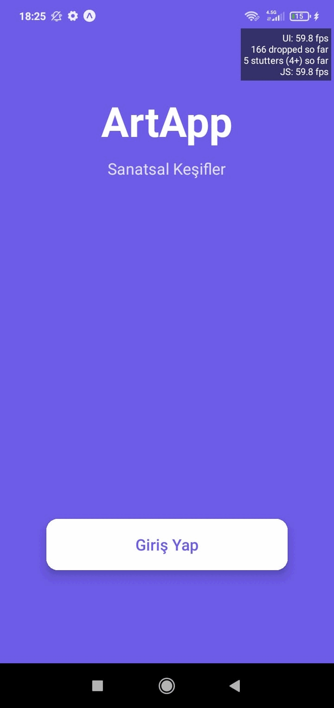
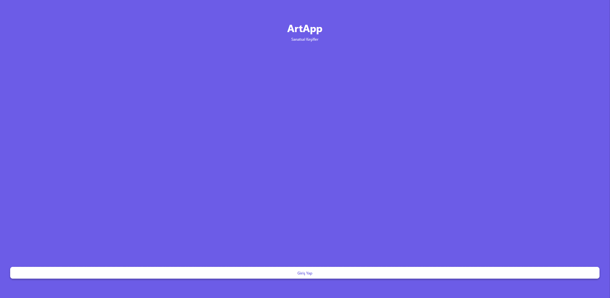

# Doodle AI 👋

## 📌 Proje İlerleme Durumu – 1. Hafta  

İlk hafta kapsamında aşağıdaki geliştirmeler tamamlanmıştır:  

* **Firebase Entegrasyonu:** Kimlik doğrulama ve veri yönetimi için Firebase başarıyla projeye entegre edildi.  
* **Menü Tasarımı:** Alt navigasyon çubuğu ile kullanıcı dostu bir menü tasarımı oluşturuldu.  
* **Ana Sayfalar:**  
  - **Giriş Sayfası** temel yapısı tamamlandı.  
  - **Tuval Sayfası, Resim çizme Sayfası** için geçici (temp) arayüzler oluşturuldu.
  - **Yapay Zeka ile resim üretim Sayfası, Profil Sayfası ve Resim Üretme Sayfası** için geçici (temp) arayüzler oluşturuldu.    

## 📌 Proje İlerleme Durumu – 2. Hafta  

İkinci hafta kapsamında aşağıdaki geliştirmeler tamamlanmıştır:  

* **Canvas Sayfası:** Canvas Sayfası optimal bir şekilde çalışması sağlandı.
* **Aİ Üretim ve Profil Sayfası:** Diğer sayfaların düzeninde yenilemeye gidildi.
* **Canvas Sayfası Ek yapılar:** Resim çizmek için farklı secenekler ve düzenlemeler eklendi mobil ve web için kontroller sağlandı.
* **Fire Base:** Resim yükleme için yapılar oluşturuldu.

## 📌 Proje İlerleme Durumu – 3. Hafta  

Üçüncü hafta kapsamında aşağıdaki geliştirmeler tamamlanmıştır:  

* **Canvas Sayfası:** Yeni özellikler eklendi son aşamaya gelindi.
* **Fire Base:** Resimlerin kayıtları sağlandı rulesler düzenlendi.
* **Profil:** Girilen hesabın kişisel profil sayfası düzenlendi ve geliştirildi çizilen resimler burada sergilenmeye başlandı.

## 📌 Proje İlerleme Durumu – 4. Hafta  

Dördüncü hafta kapsamında aşağıdaki geliştirmeler tamamlanmıştır:  

* **APİ Araştırması:** Çeşitli görsel üretme apileri denenmiş ve sonuçlar karşılaştırılmıştır.
* **Generating Sayfası:** Resim üretileceği ve görsel sunulacağı sayfalar düzenlendi.

## 📌 Proje İlerleme Durumu – 5. Hafta  

Beşinci hafta kapsamında aşağıdaki geliştirmeler tamamlanmıştır:  

* **APİ Entegrasyonu:** Api ile görsel üretme sayfası tamamlandı ve sorunsuz şekilde çalışıyor.
* **Generating Sayfası:** Resim üretimi başarıyla yapıldı ve kayıt işlemleri eklendi.
* **Generating Sayfası:** SDK53 hataları çözüldü ve sürüm hataları giderildi.

## 📌 Proje İlerleme Durumu – 6. Hafta  

Altıncı hafta kapsamında aşağıdaki geliştirmeler tamamlanmıştır:  

* **Firebase Entegrasyonu:** Firebase için keşfet sayfası özellikleri eklendi ve denendi.
* **Generating Sayfası:** RGerekli düzenlemeler yapıldı.
* **Explore Sayfası:** Keşfet sayfası oluşturuldu ve fonksiyonlar eklendi.

